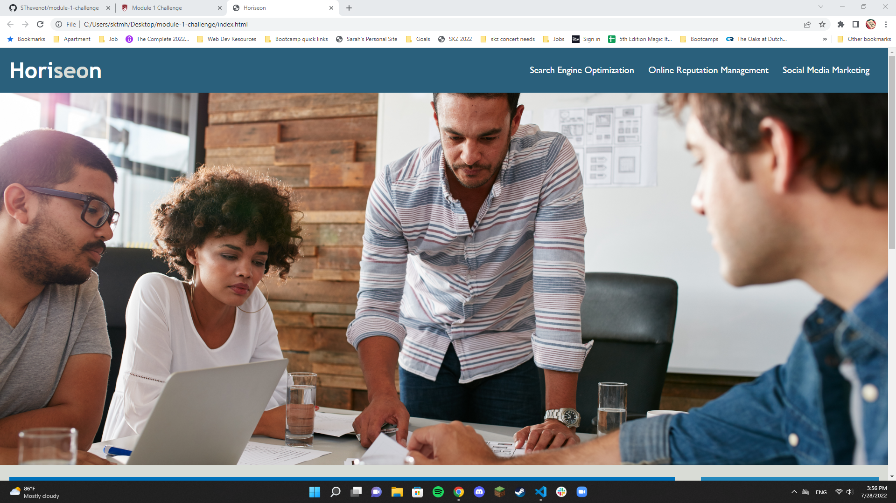
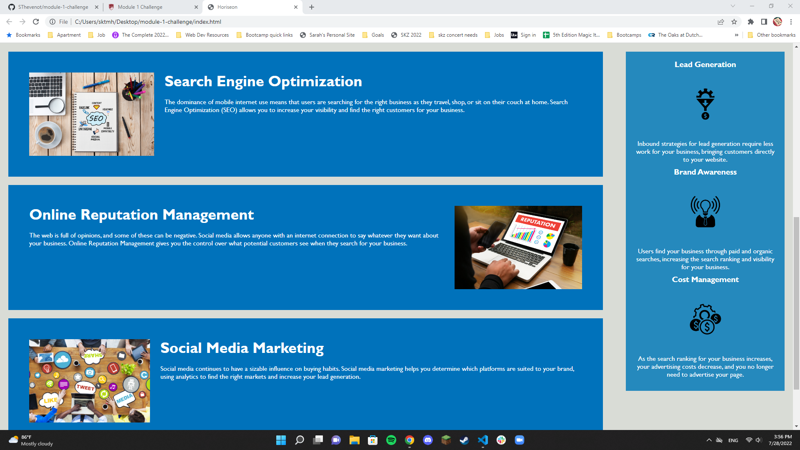
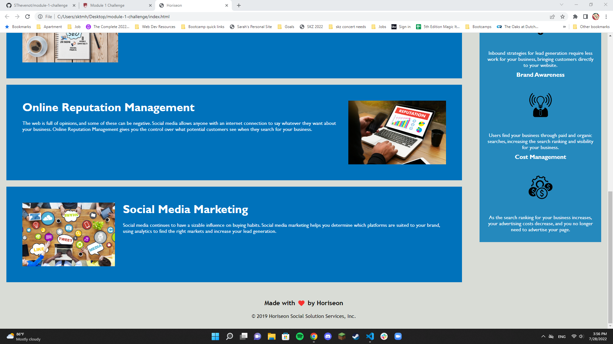

# module-1-challenge

## Description
This was an assignment to refactor the code going into the Horiseon website. The overall purpose was to help increase the quality of accessability for the website and clean up the code a bit.

I was able to shorten a lot of the CSS code, add alt tags for the images, organize the CSS layout, and fix anything that didn't work or look right along the way.

